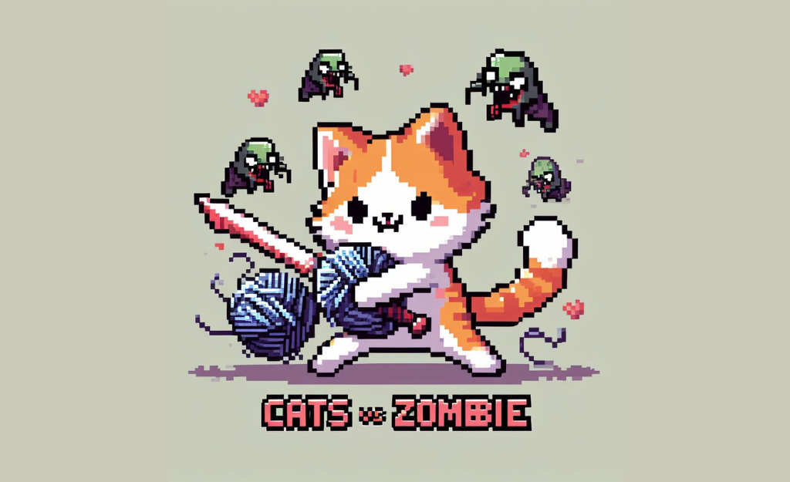

# MEOW VS ZOMBIES PROJECT
Course: OBJECT - ORIENTED PROGRAMMING

<div id="top" align="center">

</div>

[![Contributors]][contributors-url]

<!-- PROJECT LOGO -->
<br />
<div align="center">
  <a href="https://github.com/nhhongan/meow-vs-zombie.git">
  </a>

<h3 align="center">OOP MEOW vs ZOMBIES PROJECT</h3>
<h4 align="center">Team Name: Team: 27 OOP</h4>

  <p align="center">
    A Java game created with JavaFX for OOP course in International University - VNUHCM!
    <br />
    </div>


## Table of contents :round_pushpin:
1. [Introduction](#Introduction)
2. [Game](#Game)
3. [UML-class-diagram](#UML-class-diagram)
4. [Features](#Features)
5. [Challenges](#Challenges)
6. [Acknowledgments](#Acknowledgments)
7. [References](#References)
    <!-- <details>
  <summary>Table of Contents</summary>
  <ol>
    <li>
      <a href="#Introduction">Introduction</a>
      <ul>
        <li><a href="#Team-members">Team Members</a></li>
	<li><a href="#installation">Installation</a></li>
	<li><a href="#motivation">Motivation</a></li>
	<li><a href="#task-allocation">Task Allocation</a></li>      
      </ul>
    </li>
    <li><a href="#technologies">Technologies</a></li>
    <li><a href="#uml-class-diagram">UML Class Diagram</a></li>
    <li><a href="#features">Features</a></li>
    <li><a href="#challenges">Challenges</a></li>
    <li><a href="#acknowledgments">Acknowledgments</a></li>
    <li><a href="#references">References</a></li>
  </ol>
</details> -->

<!-- ABOUT THE PROJECT -->
## Introduction <a name="Introduction"></a> :bricks:
   <div align="center">

</div>

<div style="text-align:justify">
This is our game project in our Object-Oriented Programming course in semester 1 (2023 - 2024). Plants vs Zombies is an individual game that does not require players have excellent skills or advanced technology. It's a straightforward game that may be enjoyed by people of all ages. As a result of all of these factors, we developed a program that is user-friendly and assists users in having the greatest possible experiences. So, what are we waiting for? Let the story begin!
</div>

### Team Members :couplekiss_man_man:

| Order |         Name          |     ID      |                    Github account                     |                        
|:-----:|:---------------------:|:-----------:|:-----------------------------------------------------:|
|   1   | Nguyễn Phúc Minh Quân | ITDSIU22163 |      [miqua2308](https://github.com/miqua2308)      | Minh Quan |
|   2   | Nguyễn Hoàng Hồng Ân  | ITDSIU22151 |    [nhhongan](https://github.com/nhhongan)    | Hong An |
|   3   | Phạm Nguyễn Quỳnh Anh | ITDSIU22130 | [atinyanhanh](https://github.com/atinyanhanh) | Quynh Anh |
|   4   |    Đoàn Võ Thảo My    | ITDSIU22138 |    [ThaoMy44](https://github.com/ThaoMy44)    | Thao My |
|   5   |      Lê Bảo Trân       | ITCSIU21114 |    [btrannn](https://github.com/btrannn)    | Bao Tran |

### Installation :dart:

1. Open the terminal on your IDE
2. Clone the repo
   ```sh
   git clone https://github.com/nhhongan/meow-vs-zombie.git
   ```
3. Check the file status
   ```sh
   git status
   ```
4. Change branch
   ```js
   git checkout 'branch_name'
   ```

### Motivation :mechanical_arm:

<div style="text-align:justify">
As a fresher developer, we assume that the Meow vs Zombies game is one of the most simple game which helps us in practicing coding with OOP also some significant aspects of the front-end such as: How to render the game? ,….
</div>

### Task Allocation :ok_man:

| Order | Task                                               |  Person   | 
|:------|:---------------------------------------------------|:---------:| 
| 1     | Zombies, ZombieManager,...                         | Quynh Anh |   
| 2     | Meow logic, Bag, Animation,...                     | Bao Tran  | 
| 3     | Extra feature Shark, Zombie horde, World, link,... | Minh Quan |  
| 4     | Buttons, Bar, Bullet, Audio and Graphic design,... |  Thao My  |
| 5     | Scence, Fish, FishManager,...                      |  Hong An  |


<!-- Game -->
<br />

## Game <a name="Game"></a>:joystick:
### Technologies :globe_with_meridians:

- Language: [JAVA](https://www.java.com/en/)
- Framework: [IntelliJ](https://www.jetbrains.com/idea/)
- Intelligent: [A\* algorithms](https://www.geeksforgeeks.org/a-search-algorithm/)
- Library: [Java.awt](https://openjawt.io)


### How to play ? :video_game:
<div style="text-align:justify">

Players must prevent enemy zombies from crossing their front lawn and entering the house. When a horde of zombies begins to approach the house along parallel paths, the player must protect the house by placing cat on the path. Players collect a currency called "fish" to buy cats. If a zombie arrives at the house in any lane, that level is considered unsuccessful and the player will have to start that level again. After the player destroys all Zombies of this wave the player will win because we have only 1 wave
</div>

### Game logic :bulb:
- The game is divided into 2 main sides: meows and zombies. While the zombies try to attack the house, players will control the cats to defend the house at all cost. Fish is the main currency of this game, and it can be used to buy cats. There are 2 main fish resources: from the lake or from the bucket. There will be an initial amount of fish, so that player can set an initial defense at the start of the game. Zombies will come in each wave, with the wave after containing a larger amount of zombies. When a zombie is detected inside a land (row), the attacking meow will immediately fight against the zombie inside that land, up until the land is safe. Otherwise, the zombie will only attack when reaching the meow, they will stop and start attacking the cats. The game will be considered over if: a zombie manages to reach the house (lose) or all zombies in the last wave are defeated (win).

<div align="center">
</div>


<br />

### Game flow :bulb:
- The first interface that appears when opening the game will be the MAIN MENU with 2 buttons: PLAY and EXIT. Selecting PLAY will bring up a PLAY screen and wait around 10 second, then Zombie will appear. Players use mouse clicks to interact with the Cats in the Bar to fight against Zombies, or use a Bag to pickup cats, or interact with the Fish on the screen. When any Zombie passes all the cells, the player will lose and the LOSE screen will appear, the user will return to the main screen to restart the game from the beginning. If the player completes all the Waves, they win and return to the main screen. On the Playing screen there is a SETTING button, it is used to pause the game, then users can choose RESUME to continue the game, or EXIT to exit the game.

<div align="center">
</div>

<br />

###  Game description
    Character:
- Meow: Meows possess unique abilities and characteristics to protect the garden against zombies. They are strategically placed on the game's grid-like lawn to counter different types of zombies.
- Zombies: Zombies are the primary adversaries in the game, with the objective of invading the garden and devouring plants. Understanding the different zombie types and their behaviors is crucial for developing effective defense strategies.
- Shark : A powerful creature that live under the lake and help the meows defeat zombies. It will attack one time each row, and only attack when zombie reach the shark range.

<div align="center">
</div>

    Items:
- Fish: Fish acts as a crucial resource that players must manage effectively to collect and sustain their plants. It is used to purchase and deploy cats in the garden.
- Bullet: Such as peas, are used by meow to damage and eliminate zombies. Meow fire bullet to fend off the zombie threat.

<div align="center">
</div>

     Environment:
- Tile refers to the individual units on the playing field where players can place their defense. The grid-based layout allows for strategic positioning and creating defensive formations.
- Selection Frame highlights the targeted tile, helping players identify and interact with specific tiles on the grid.
- Meow Bar is a user interface element that displays the available cat options for players to choose from. It allows players to select and place cats on the grid to defend against the incoming zombie horde.

<div align="center">
</div>

    User Manual:

<div align="center">
</div>


         Mouse Controller: 
                    Playing Meow vs. Zombies with a mouse is straightforward. 
                    Here's a general overview of how to control the game using a mouse:
- Menu Navigation: Use the mouse cursor to select options in the game's menus.
- Meow Selection: Click on plant icons to select and pick up a desired meow.
- Meow Placement: Move the cursor to the desired location on the grid and left-click to place the selected meow.
- Fish Collection: Move the cursor over falling sunlight to collect it as in-game currency for purchasing and placing plants.

<div align="center">
</div>
<div align="center">
</div>
<br />

## UML Class Diagram<a name="UML-class-diagram"></a>:clipboard:
<!--  -->
<div>
	<h3>1.MEOWS AND ZOMBIES CLASS DIAGRAM </h3>
    <div align="center">
        
    </div>
    <br />
	<div align="center">------------------------------------</div>
    <br />
   <h3>2. MEOW CLASS DIAGRAM </h3>
     <div align="center">
        
    </div>
    <br />
  <div align="center">------------------------------------</div>
  <br />
  <h3>3. ZOMBIES CLASS DIAGRAM </h3>
   <div align="center">
        
    </div>
    <br />
	<div align="center">------------------------------------</div>
    <br />
  </div>

  <!-- FEATURES -->
## Features<a name="Features"> :triangular_flag_on_post:
- Completed: UX/UI, sound of game, enhancing algorithms
- Incompleted: some new meow and natural conditions such as day or night, more wave
  <br />

<!-- CHALLENGES -->
## Challenges<a name="Challenges">:bangbang:
- Working environment (Github)
  <br />

  ## Acknowledgments<a name="Acknowledgments">:brain:
<div style="text-align:justify">
We would like to express our sincerest thanks to the teachers and people who helped us achieve the goal of this project:
  <br />
    - Dr. Tran Thanh Tung - Deputy Faculty of Information Technology - International University - Vietnam National University, Ho Chi Minh City
  <br />
    - MSc. Nguyen Quang Phu - Researcher at Faculty of Information Technology - International University - Vietnam National University, Ho Chi Minh City

</div>

<br />
	<br />
  </div>

## References<a name="References">  :eye::tongue::eye:
1. [The Mechanism of 2D Games](https://www.youtube.com/watch?v=om59cwR7psI&list=PL_QPQmz5C6WUF-pOQDsbsKbaBZqXj4qSq)
2. [GUI](https://www.youtube.com/watch?v=7GaAW-DdPuI&pp=ygUOamZyYW1lIGluIGphdmE%3D)
3. [Mouse listener](https://www.youtube.com/watch?v=jptf1Wd_omw&t=197s&pp=ygUdbW91c2VsaXN0ZW5lciBhbmQga2V5bGlzdGVuZXI%3D)
4. [SOLID principles](https://www.youtube.com/watch?v=_jDNAf3CzeY&pp=ygURY29kZSBnYW1lIGluIGphdmE%3D)

<br />

<p align="right">(<a href="#top">Back to top</a>)</p>

<!-- MARKDOWN LINKS & IMAGES -->
<!-- https://www.markdownguide.org/basic-syntax/#reference-style-links -->

[contributors-url]: https://github.com/nhhongan/meow-vs-zombie/graphs/contributors
  
  


               
            


  
    
